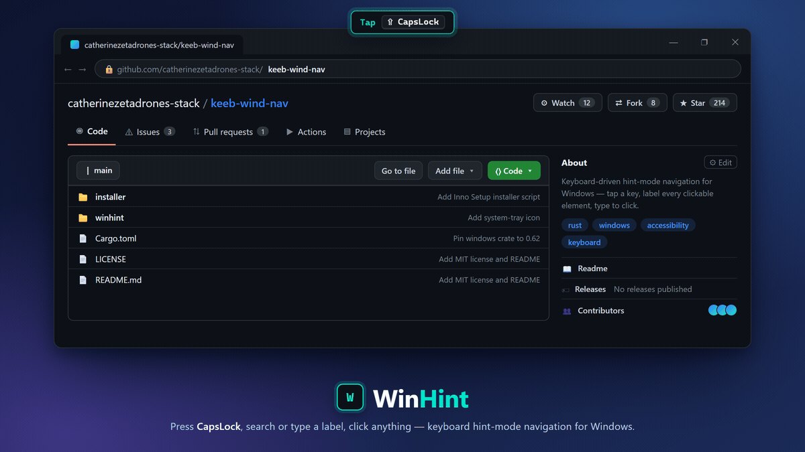

<p align="center">
  
</p>

# WinHint

**Keyboard-driven hint-mode navigation for Windows.** Tap a key, get alphabetic
labels on every clickable UI element, type to click. Like [Vimac][vimac] /
Homerow on macOS — but for Windows 10 and 11.

No more reaching for the mouse: press **CapsLock**, the screen fills with hint
labels over buttons, links, tabs, and fields, and you type the label (or search
by name) to click it.

---

## Features

- **Hint mode** — tap CapsLock and every clickable element gets a short label;
  type the label to left-click it (Shift to right-click).
- **Search-as-you-type** — three modes, cycled with Tab:
  - **Both** — match hint labels *and* element names at once.
  - **Search** — filter by accessible name (e.g. type `save`).
  - **Hints** — classic label-pick only.
- **Arrow-key selection** — `↑`/`↓` move through matches, `Enter` clicks.
- **Window resize mode** — double-tap CapsLock to get resize handles on the
  focused window's edges and corners (`a`–`h`); grab one and nudge it with the
  arrow keys (`Shift` = 1-pixel fine steps), `Enter` to commit, `Esc` to restore.
- **Runs in the tray** — a notification-area icon (no taskbar clutter); right-click
  to pause/resume or quit.
- **DPI-aware** and multi-monitor friendly.

## How it works

WinHint is a small Rust daemon built on `windows-rs`:

1. A global low-level keyboard hook (`WH_KEYBOARD_LL`) watches for the trigger.
2. On activation it walks the foreground window's **UI Automation** tree to find
   clickable elements and their on-screen rectangles.
3. A transparent, click-through overlay — a **WebView2** surface in composition
   mode — draws the hint labels exactly over each element.
4. Your keystrokes filter the labels; a match dispatches a real click via
   `SendInput`.

## Requirements

- Windows 10 or 11 (x64)
- [WebView2 Runtime][webview2] (preinstalled on Windows 11; the Evergreen runtime
  on Windows 10)
- [Rust][rust] (stable) to build from source

## Build & run

```bash
# from the winhint/ crate directory
cd winhint

# debug build + run
cargo run

# release build → winhint/target/release/winhint.exe
cargo build --release
```

Launch the binary and it sits quietly in the tray until you press CapsLock.

## Usage

| Action | Key |
|---|---|
| Enter / leave hint mode | Tap **CapsLock** (or **Esc** to leave) |
| Click a hint | Type its label |
| Right-click a hint | **Shift** + complete the label |
| Move selection | **↑** / **↓** |
| Click the selection | **Enter** (**Shift+Enter** = right-click) |
| Cycle match mode (Both / Search / Hints) | **Tab** |
| Enter window-resize mode | **Double-tap CapsLock** |
| Grab a resize handle | Type its label (**a**–**h**) |
| Resize | Arrow keys (**Shift** = fine 1px) |
| Commit / restore resize | **Enter** / **Esc** |
| Pause, resume, or quit | Right-click the **tray icon** |
| Quit | **Ctrl + Alt + Q** |

## Known limitations

- **Electron / WebView app content** (e.g. the VS Code editor surface, some
  in-page web content) is not always visible to UI Automation, so elements inside
  it may not get hints.
- **UAC-elevated windows** can't be hooked by a non-elevated process; run WinHint
  elevated to drive admin windows.
- Inner **pane / panel resizing** is experimental and parked — see [TODO.md](TODO.md).

## Contributing

Issues and pull requests are welcome. Fork it, build it, and open a PR — please
keep attribution to the original author per the license below.

## License

[MIT](LICENSE) © 2026 Phillip L. Bronson. You're free to use, modify, and
distribute this software, including for commercial purposes, with attribution.

## Acknowledgements

Inspired by [Vimac][vimac] and Homerow on macOS, reimagined for Windows.

[vimac]: https://github.com/dexterleng/vimac
[webview2]: https://developer.microsoft.com/microsoft-edge/webview2/
[rust]: https://www.rust-lang.org/tools/install
